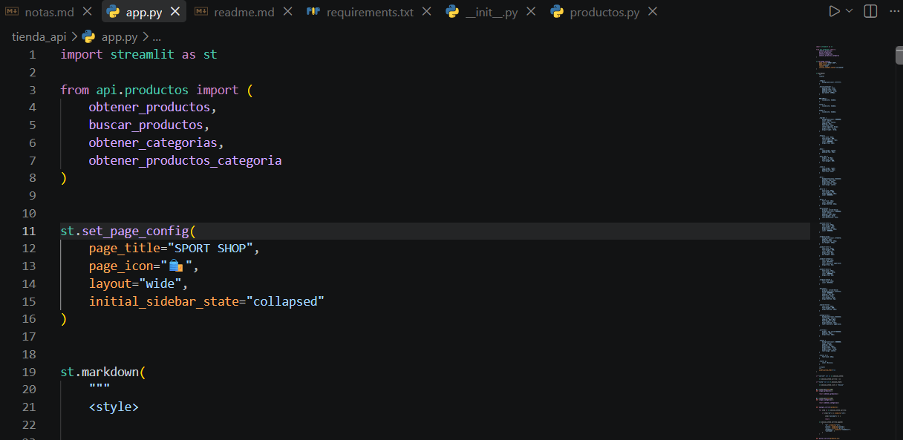
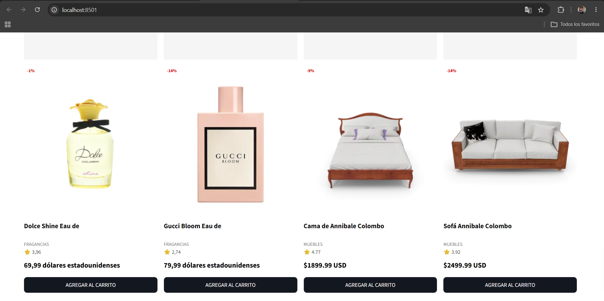
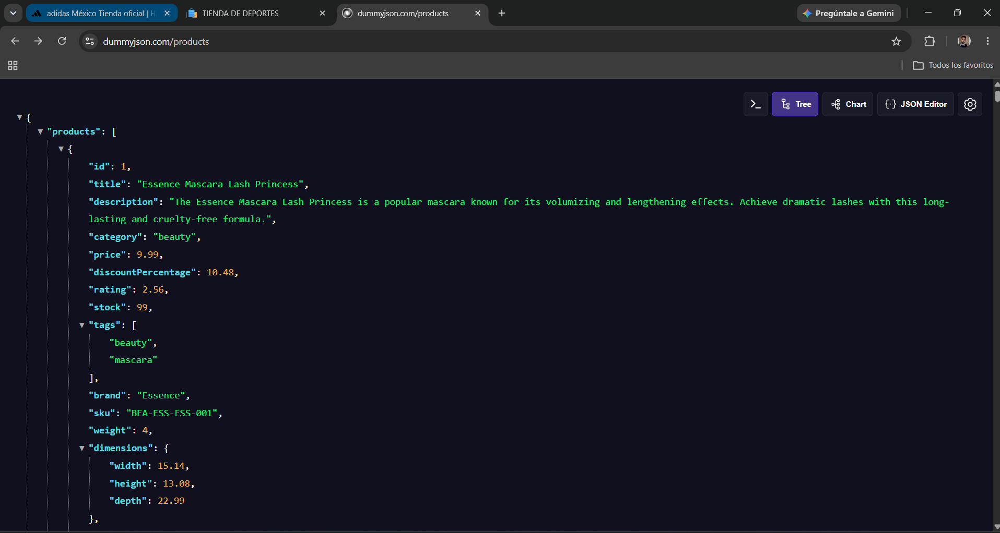

# Examen de unidad 1 Programación Web
### Desarrollado por Diego Guadalupe Sanchez Montalvo

## Ejemplo del codigo

## Ejemplo de la interface

## Ejemplo del Api Consumida

## LINK:
# URL principal de la API
URL_API = "https://dummyjson.com/products"